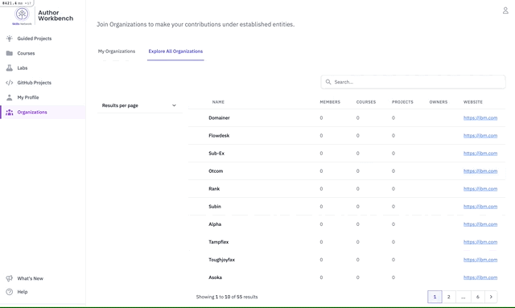

# SnFilterable

Welcome to the Skills Network Filterable gem!

This gem provides a method for developers to quickly implement a live-reloading search and filter foor their data with live-reloading.

Live examples of the gem's use can be viewed at [Skills Network's Author Workbench](https://author.skills.network), primarily under the [organizations tab](https://author.skills.network/organizations)



## Requirements

There are a couple key requirements for your app to be compatible with this gem:

1. You need to have [AlpineJS](https://alpinejs.dev/essentials/installation) loaded into the page you plan to use SnFilterable
2. Your app needs to be running [TailwindCSS](https://tailwindcss.com/docs/guides/ruby-on-rails)

## Installation

Add this line to your application's Gemfile:

```ruby
gem "sn_filterable", git: "https://github.com/ibm-skills-network/sn_filterable.git"
```

And then execute:
```bash
bundle install
```

##### Make the following adjustments to your codebase

1. Add the necessary translations and customize as desired
```yaml
# en.yml
en:
    # Other translations
    shared:
        filterable:
        view_filter_button: "View filters"
        results_per_page: "Results per page"
        clear_all: "Clear all"
        pagination:
            previous_page: "Previous"
            next_page: "Next"
```

2. Require the necessary JavaScript (dependent on AlpineJS being included with your App)
```javascript
// application.js converted to application.js.erb

// other imports
<%= SnFilterable.load_js %>
```

3. Configure your app's Tailwind to scan the gem
```javascript
// tailwind.config.js
const execSync = require('child_process').execSync;
const output = execSync('bundle show sn_filterable', { encoding: 'utf-8' });

module.exports = {
  // other config settings
  content: [
    // other content
    output.trim() + '/app/**/*.{erb,rb}'
  ]
  // other config settings
};
```

## Usage

TODO: Write usage instructions here

## Testing / Development

This gem using [RSpec](https://rspec.info) for testing. Tests can be running locally by first setting up the dummy database/app as follows:

```bash
docker compose up -d
cd spec/dummy
rails db:create
rails db:schema:load
```


Now the test suite can be run from the project root using 
```bash
bundle exec rspec
```

## Contributing

Bug reports and pull requests are welcome on [GitHub](https://github.com/ibm-skills-network/sn_filterable).

## License

The gem is available as open source under the terms of the [MIT License](https://opensource.org/licenses/MIT).
